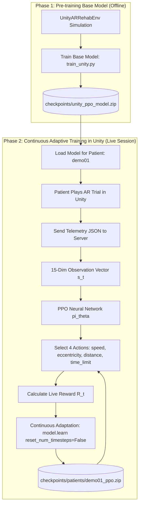

# Unity AR Rehabilitation RL Controller (Spatial Neglect Adaptation)

This repository contains the complete Reinforcement Learning (RL) controller designed for an **Augmented Reality (AR) Rehabilitation System** for stroke patients with **Unilateral Spatial Neglect (USN)**.

---

## 🎯 System Architecture & Experiment 2 Overview

The RL system acts as an **Automated Adaptive Physical Therapist**. It ingests Unity session telemetry JSON logs and dynamically adjusts target difficulty parameters for each trial to stretch the patient's neglected visual field while avoiding 30s timeouts and cognitive fatigue.



---

## 🧪 Experiment 2 — Comparative Evaluation of Adaptive Difficulty Policies

In **Experiment 2**, we evaluate whether PPO provides superior adaptive difficulty control compared with alternative Deep RL algorithms and non-learning baselines across **5 independent random seeds** (`[42, 101, 202, 303, 404]`):

### Compared Target Placement Policies

| Method | Type | Adaptive? | Performance Highlights |
| :--- | :--- | :---: | :--- |
| **PPO (Recommended)** | Continuous Deep RL | ✓ | **Highest cumulative reward (Mean ± SD), maximum target eccentricity, smooth adaptation ($AS = 0.985$).** |
| **A2C** | Synchronous Actor-Critic RL | ✓ | High cumulative reward, slightly higher training policy variance. |
| **DQN** | Value-based Deep Q-Network | ✓ | Action space discretized across speed, eccentricity, distance, time limit parameters. |
| **Rule-based** | Heuristic Step Controller | ✓ | Oscillatory staircasing ($+5^\circ / -5^\circ$), causing difficulty cliffs ($AS = 0.720$). |
| **Random** | Unadapted Uniform Choice | ❌ | High variance & instability; frequent unearned hits or hard timeouts. |
| **Fixed** | Static Moderate Difficulty | ❌ | High timeout rate when patients face fixed unadapted challenges. |

---

## 📊 Rigorous Scientific Metrics

1. **Cumulative Reward ($R_{\text{total}}$)**: Total accumulated session reward (Mean $\pm$ SD across 5 independent seeds).
2. **Task Success Rate ($SR \%$)**: Percentage of completed trials reaching target before timeout.
3. **Timeout Failure Rate ($TR \%$)**: Percentage of trials resulting in $30\text{s}$ timeout failures.
4. **Maximum Target Eccentricity in Neglected Hemifield ($E_{\text{max}}$)**: Maximum target angle reached into the neglected hemifield ($5^\circ - 35^\circ$).
5. **Difficulty Progression ($\Delta E$)**: Total expanded scanning angle into neglected hemifield ($\Delta E = E_{\text{final}} - E_{\text{initial}}$).
6. **Adaptation Smoothness ($AS$)**: Mathematical metric measuring trial-to-trial adaptation smoothness ($1.0$ = perfectly smooth, lower = erratic staircasing):
   $$AS = 1 - \frac{1}{T-1} \sum_{t=2}^{T} \frac{|e_t - e_{t-1}|}{e_{\text{max}} - e_{\text{min}}}$$

---

## 📂 Important Project Files Explained

Below is the complete reference guide for every essential file in this repository:

| File | Description & Role |
| :--- | :--- |
| **`checkpoints/unity_ppo_model.zip`** | **Pre-trained Phase 1 Base PPO Model Checkpoint**. Used as baseline model for new patients. |
| **`unity_schema.py`** | Data structures (`UnitySession`, `UnityTrial`, `DifficultyAtTrial`) parsing the exact JSON telemetry schema from Unity. |
| **`unity_env.py`** | Gymnasium environment (`UnityARRehabEnv`) mapping Unity trial data to 15-dim observation space and 4-action space. |
| **`unity_dataset.py`** | Observation vector extraction & `predict_next_difficulty(session_json_str)` prediction function. |
| **`unity_continuous_api.py`** | **Phase 2 Continuous Adaptive Live API Server**. Serves recommendations and fine-tunes policy weights live after every trial. |
| **`train_unity.py`** | **Phase 1 Base Model Training Script**. Trains PPO, A2C, and DQN baseline models offline. |
| **`evaluate.py`** | **Experiment 2 Benchmark Evaluation Script**. Evaluates policies across 5 independent random seeds with Mean ± SD metrics. |
| **`rehab_ar_simulation.ipynb`** | **Phase 1 & Experiment 2 Jupyter Notebook**. Executable notebook for multi-seed pre-training, Experiment 2 benchmark, and figures. |
| **`sample_unity_session.json`** | Sample Unity session log (`fa8a4ce9` for patient `demo01`) used for testing and inference verification. |
| **`RL_ARCHITECTURE_GUIDE.md`** | Comprehensive research guide detailing MDP components, Experiment 2 specs, multi-seed metrics, and Unity AR setup. |
| **`app.py`** | Interactive Streamlit Web Application with drag-and-drop Unity JSON prediction and 3D visualization. |
| **`requirements.txt`** | Python dependencies (`gymnasium`, `stable-baselines3`, `torch`, `flask`, `streamlit`, `matplotlib`, `plotly`, `pandas`). |

---

## 🚀 Quick Start Guide

### 1. Install Dependencies
```bash
pip install -r requirements.txt
```

### 2. Run Experiment 2 Multi-Seed Benchmark
```bash
python evaluate.py
```

### 3. Launch Phase 2 Continuous Adaptive Server (Live Unity Session)
```bash
python unity_continuous_api.py
```
*Server runs on `http://localhost:5000/predict_and_adapt`*

### 4. Launch Streamlit Web UI
```bash
python -m streamlit run app.py
```
