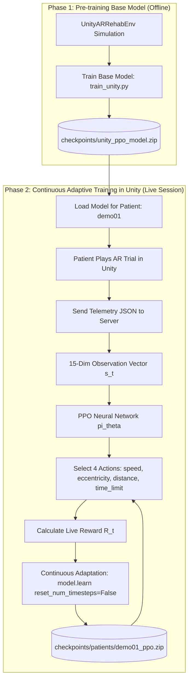

# Unity AR Rehabilitation RL Controller (Spatial Neglect Adaptation)

This repository contains the complete Reinforcement Learning (RL) controller designed for an **Augmented Reality (AR) Rehabilitation System** for stroke patients with **Unilateral Spatial Neglect (USN)**.

---

## 🎯 System Architecture Overview & Experiment 2

The RL system acts as an **Automated Adaptive Physical Therapist**. It ingests Unity session telemetry JSON logs and dynamically adjusts target difficulty parameters for each trial to stretch the patient's neglected visual field while avoiding 30s timeouts and cognitive fatigue.

### 🧪 Experiment 2 — RL Validation Benchmark
To prove the RL contribution, we benchmark simulated patients across **6 target placement methods**:

| Method | Type | Adaptive? |
| :--- | :--- | :---: |
| **Fixed** | Static Moderate Difficulty | ❌ |
| **Random** | Unadapted Uniform Choice | ❌ |
| **Rule-based** | Heuristic Step Controller | ✓ |
| **PPO (Recommended)** | Deep Reinforcement Learning | ✓ |
| **DQN** | Deep Reinforcement Learning | ✓ |
| **A2C** | Deep Reinforcement Learning | ✓ |



---

## 📂 Important Project Files Explained

Below is the complete reference guide for every essential file in this repository:

| File | Description & Role |
| :--- | :--- |
| **`checkpoints/unity_ppo_model.zip`** | **Pre-trained Phase 1 Base PPO Model Checkpoint**. Used as the baseline model for new patients. |
| **`unity_schema.py`** | Data structures (`UnitySession`, `UnityTrial`, `DifficultyAtTrial`) parsing the exact JSON telemetry schema from Unity. |
| **`unity_env.py`** | Gymnasium environment (`UnityARRehabEnv`) mapping Unity trial data to a 15-dimensional observation space and 4-action space. |
| **`unity_dataset.py`** | Observation vector extraction & `predict_next_difficulty(session_json_str)` prediction function. |
| **`unity_continuous_api.py`** | **Phase 2 Continuous Adaptive Live API Server**. Serves recommendations and fine-tunes policy weights live after every trial. |
| **`train_unity.py`** | **Phase 1 Base Model Training Script**. Trains PPO, DQN, and A2C baseline models offline. |
| **`evaluate.py`** | **Experiment 2 Benchmark Evaluation Script**. Evaluates Fixed, Random, Rule-based, PPO, DQN, A2C on simulated patients. |
| **`rehab_ar_simulation.ipynb`** | **Phase 1 & Experiment 2 Jupyter Notebook**. Executable notebook for pre-training, Experiment 2 benchmark, and research figures. |
| **`sample_unity_session.json`** | Sample Unity session log (`fa8a4ce9` for patient `demo01`) used for testing and inference verification. |
| **`RL_ARCHITECTURE_GUIDE.md`** | Comprehensive research guide detailing MDP components, Experiment 2 specs, and Unity AR Foundation setup. |
| **`app.py`** | Interactive Streamlit Web Application with drag-and-drop Unity JSON prediction and 3D visualization. |
| **`requirements.txt`** | Python dependencies (`gymnasium`, `stable-baselines3`, `torch`, `flask`, `streamlit`, `matplotlib`, `plotly`, `pandas`). |

---

## 📊 15-Dimensional State Vector & 4 Dynamic Actions

### 15-Dimensional Observation Vector
- `obs[0]`: Previous trial hit status (1.0 or 0.0)
- `obs[1]`: Reaction time normalized (`reaction_time_ms` / 30,000 ms)
- `obs[2]`: Gaze angle offset normalized (`gaze_angle_deg` / 90°)
- `obs[3]`: Hemifield indicator (1.0 if neglected side, 0.0 if non-neglected)
- `obs[4]`: Current target speed (0.2 - 0.8 m/s)
- `obs[5]`: Current target eccentricity (5° - 35°)
- `obs[6]`: Current target distance (0.8 - 2.5 m)
- `obs[7]`: Target count normalized (fixed at 3)
- `obs[8]`: Time limit normalized (`time_limit_s` / 45.0 s)
- `obs[9]`: Rolling hit rate (last 5 trials)
- `obs[10]`: Rolling average reaction time (last 5 trials)
- `obs[11]`: Consecutive timeout failure count
- `obs[12]`: Neglect side indicator (1.0 for Left Neglect, 0.0 for Right Neglect)
- `obs[13]`: Session progress ratio (`trial_idx` / 60)
- `obs[14]`: Accumulated cognitive fatigue estimate

### 4 Dynamic RL Actions
1. **`speed`**: 0.2 - 0.8 m/s (Movement speed challenge)
2. **`eccentricity_deg`**: 5.0° - 35.0° (Scanning angle into neglected hemifield)
3. **`distance_m`**: 0.8 - 2.5 m (3D AR depth distance)
4. **`time_limit_s`**: 10.0 - 45.0 s (Dynamic trial timeout window)
*(Note: `target_count` is kept as a fixed constant = 3 for visual clutter control)*

---

## 🚀 Quick Start Guide

### 1. Install Dependencies
```bash
pip install -r requirements.txt
```

### 2. Run Experiment 2 RL Validation Study
```bash
python evaluate.py
```

### 3. Launch Phase 2 Continuous Adaptive Server (Live Unity Session)
```bash
python unity_continuous_api.py
```
*Server runs on `http://localhost:5000/predict_and_adapt`*

### 4. Launch Streamlit Web UI
```bash
python -m streamlit run app.py
```
